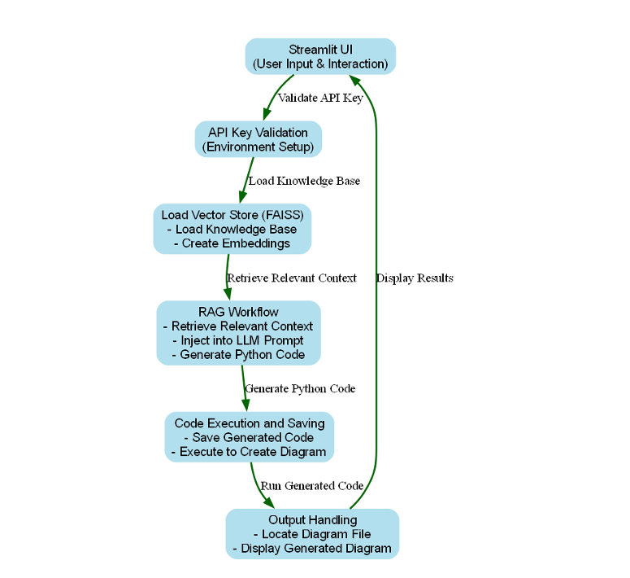

# LLM-Powered Data Architecture Diagram Creator

## Overview
An **LLM-powered tool** that generates **AWS cloud architecture diagrams** from natural language input.

## Features
- **Natural Language Query**: Describe architecture in plain text.
- **Context Retrieval**: Fetches relevant AWS service details.
- **Code Generation**: Produces Python code for diagrams.
- **Visual Output**: Displays diagrams using the Diagrams library.

## Technologies Used
- **Python**
- **LangChain** (LLM workflow)
- **Streamlit** (UI)
- **FAISS** (Vector search)
- **OpenAI API** (NLP)
- **Diagrams Library** (Diagram generation)
- **AWS Services** (Lambda, DynamoDB, Step Functions, S3)

## How It Works
1. **User Input**: Enter architecture requirements.
2. **Knowledge Retrieval**: Fetch AWS service details.
3. **Code Generation**: LLM creates Python code.
4. **Diagram Generation**: Executes code for visualization.
5. **Display**: Shows the architecture diagram in Streamlit.

## Installation
```bash
git clone https://github.com/your-repo/llm-diagram-creator.git
cd llm-diagram-creator
pip install -r requirements.txt
```

## How to Run
```bash
streamlit run app.py
```

## Future Enhancements
- **Multi-cloud support** (Azure, GCP)
- **Advanced AI models** (GPT-4+)
- **Interactive UI** (Drag-and-drop editing)
- **Collaboration Tools** (Multi-user support)

## Contributors
- **Your Name** - Santhosh, Vishnu Teja

## Video Demo
[LLM_Project_Output-Video.mp4](..%2FLLM_Project_Output-Video.mp4)


## Architecture Diagram!


